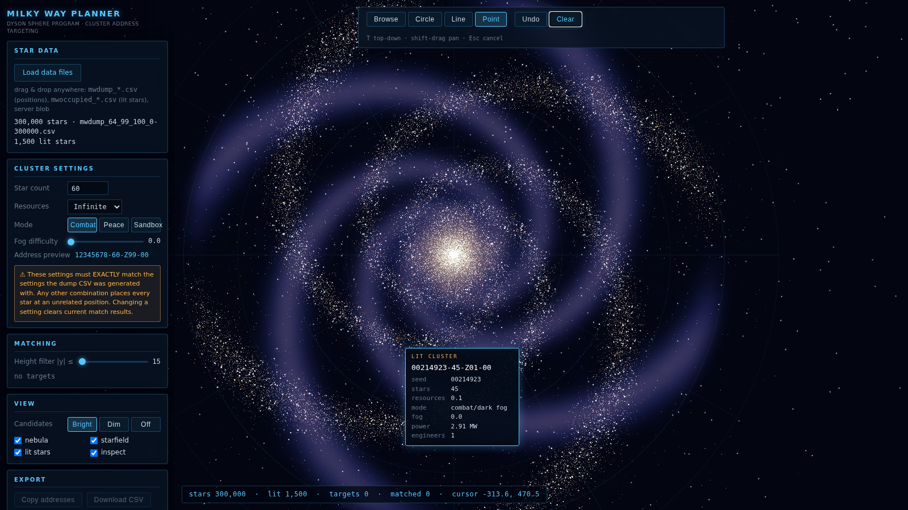

# DSP Milky Way Planner

A local, single-user web app for planning shapes on **Dyson Sphere Program**'s
shared Milky Way leaderboard galaxy. Load a position dump CSV, draw circles /
lines / points on the galactic plane, and get the exact list of **cluster
addresses** (seed + settings) to play so those stars light up in the real
in-game galaxy.



## Quick start (no toolchain)

Open **`dsp-milky-way-planner.html`** in a browser (double-click). It's a
fully self-contained build — no server, no install, no network.

Then load your dump CSV (file picker or drag & drop), e.g.
`mwdump_64_99_100_0-1000000.csv`.

## How it works

Every DSP settings combination (seed, star count, resource multiplier, mode,
Dark Fog difficulty) maps to one fixed position in the shared galaxy
(`MilkyWayGenerator.GenerateClusterPosition(898, seedKey)`). Positions use
Unity's Perlin noise and cannot be computed outside the game, so this app
consumes a CSV dumped in-game by the MWDump BepInEx plugin
(`seed,x,y,z`, one row per seed).

> ⚠️ **A dump is only valid for the exact settings it was generated with.**
> Changing any setting (star count, resources, mode, fog difficulty) moves
> every star to an unrelated position. The app prefills its settings panel
> from the dump filename and clears match results if you change anything.

### Workflow

1. **Load** the dump CSV — settings prefill from the filename pattern
   `mwdump_{starCount}_{resCode}_{suffix}_{start}-{end}.csv`.
2. **Navigate**: drag to orbit, wheel to zoom, right-drag / shift-drag to pan,
   `T` for top-down.
3. **Draw** with the Circle / Line / Point tools (hotkeys `C` `L` `P`, `B` for
   browse; `Esc` cancels a pending line; Undo / Clear in the toolbar).
4. **Match**: every target dot is matched to the nearest unused seed via a
   spatial hash (instant at 1M+ points). The height filter (|y| ≤ 15 by
   default) keeps shapes on flat-disk stars so they don't look warped from
   angled cameras. No seed is ever used twice.
5. **Export**: copy addresses to the clipboard (one per line, e.g.
   `00556881-64-Z99-00`) or download a CSV with
   `role,seed,cluster_address,star_count,resources,mode,fog_difficulty,x,y,z,err_xz`.

To light a star, start a new game with EXACTLY the listed settings and build a
Dyson sphere that uploads power to the leaderboard. Each dot = one playthrough.

## Lit stars overlay (in-game view)

The planner can render the already-lit leaderboard stars like the in-game
Milky Way screen — bright glows sized and colored by generated power, on top
of the candidate cloud (which you can dim or hide in the **View** panel).

1. Compile the updated plugin (`docs/plugin/MilkyWayDumpPlugin.cs` — same
   build command as before), open the in-game **Milky Way** screen, press
   **F10**. It writes `mwoccupied_*.csv` (`seedkey,x,y,z,caps,engineers`).
2. Drag that file into the planner (alongside the position dump).
3. Hover any lit star to see its decoded identity — cluster address, seed,
   star count, resources, mode, fog difficulty, power, engineers. Click to
   pin the tooltip. Hovering a candidate star (Browse tool) shows its seed
   and the address it would have under the current settings.
4. Optional: refresh power/engineer stats without launching the game via
   `scripts/fetch-milkyway.mjs` — currently blocked on capturing the game's
   login exchange; see `docs/live-fetch.md`.

## Can positions be reverse-engineered? (x,y,z → seed)

No — not analytically. The game scatters clusters with Unity's Perlin noise;
it's a one-way hash-like mapping with no inverse formula, and neighboring
positions have unrelated seeds. The dump **is** the inverse: a lookup table of
`seed → position` that the app searches nearest-neighbor (that's exactly what
shape matching does). Lit stars are the exception — they carry their full
`seedKey`, which decodes exactly back to seed + settings (the tooltip shows
this).

Want more candidates ("all possible points")? Generate bigger dumps: raise
`SeedEnd` in the plugin (up to 100,000,000). Tip: set `YFilter` (e.g. `20`) to
keep only flat-disk stars — that covers the full seed space in roughly 1/6 of
the rows, which is what shape matching uses anyway.

## Address format

Implemented byte-exactly from the decompiled game (`GameDesc.seedKey64` /
`GameDesc.clusterString`):

```
seedKey = seed*100000000 + starCount*100000 + resCode*1000 + suffix
suffix: 0 = peace (A) | 100 + fogDiff*10 = combat (Z) | 999 = sandbox (S)
combat:  {seed:08d}-{stars}-Z{res:02d}-{fog:02d}     e.g. 99881893-64-Z99-00
peace:   {seed:08d}-{stars}-A{res:02d}
sandbox: {seed:08d}-{stars}S{res:02d}
```

`resCode` = resource multiplier × 10; Infinite = 99.

## Development

```bash
npm install
npm run dev            # dev server
npm test               # unit tests (address packing, filename parse, matcher)
npm run build:release  # dist/index.html -> dsp-milky-way-planner.html
```

Test without a real dump:

```bash
node scripts/make-synthetic-dump.mjs 300000   # writes testdata/mwdump_64_99_100_0-300000.csv
npm run build && node scripts/e2e.mjs         # Playwright end-to-end checks
```

(Point `PLAYWRIGHT_CHROMIUM` at a chromium binary if Playwright's own download
isn't available.)

### Architecture

- `src/csv/` — streaming CSV parser into typed arrays (Web Worker, with a
  main-thread fallback for `file://` where blob workers are blocked); routes
  files by header (`seed,` = positions, `seedkey,` = occupied, else blob).
- `src/address.js`, `src/filename.js` — seedKey / cluster-address formats,
  including `unpackSeedKey` (seedKey → seed + full settings).
- `src/occupied/` — lit-star dump/blob parsing, stats merging, overlay layer.
- `src/match/` — CSR spatial hash on x/z (6-unit cells) + expanding-ring
  nearest-neighbor matching with height filter and seed uniqueness.
- `src/render/` — three.js: additive point-cloud galaxy, orbit controls with
  click-vs-drag threshold, marker layers (amber targets, cyan matches).
- `src/tools.js` — circle / line / point drawing with live ghost previews.
- `src/ui/panels.js` — settings, matching report, export, HUD.

Roadmap hooks (v2): occupied-clusters overlay from the leaderboard server
blob, multiple dumps loaded at once, target-set save/load, text stencils.
